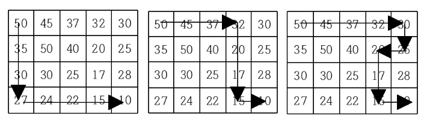
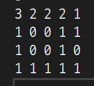

# [내리막 길](https://www.acmicpc.net/problem/1520)

```cpp
#include <iostream>
#include <vector>
#include <utility>
#include <tuple>

#define end "\n"

using namespace std;

using Point2D = pair<int, int>;

static vector<vector<int>> offsets = {
	{0,1},
	{1,0},
	{0,-1},
	{-1,0}
};

int dfs(vector<vector<int>>& board, vector<vector<int>>& visited, Point2D s, const Point2D& e) {
	int answer = 0;
	if (s == e) return 1;

	int x, y;
	for (const auto& offset : offsets) {
		tie(x, y) = s;
		x += offset[0]; y += offset[1];
		if (x < 0 || x > e.first) continue;
		if (y < 0 || y > e.second) continue;
		if (board[s.second][s.first] <= board[y][x]) continue;
		if (board[y][x] < board[e.second][e.first]) continue;
		if (visited[y][x] == -1) continue;
		if (visited[y][x] != 0) {
			answer += visited[y][x];
			continue;
		}
		auto res = dfs(board, visited, Point2D{ x,y }, e);
		if (res) {
			visited[y][x] = res;
		}
		else {
			visited[y][x] = -1;
			continue;
		}
		answer += res;
		visited[s.second][s.first] += visited[y][x];
	}

	return answer;
}

int main() {
	cin.tie(0)->sync_with_stdio(0);

	int M, N;
	cin >> M >> N;
	vector<vector<int>> board(M, vector<int>(N)), visited(M, vector<int>(N));

	for (auto& cntr : board)
		for (auto& item : cntr)
			cin >> item;

	cout << dfs(board, visited, { 0,0 }, { N - 1,M - 1 });

	return 0;
}
```

## 해결
일단 경로 탐색이라는 점에서 DFS를 캐치했다. 일단 다른 사항은 미뤄두고 기본적인 DFS를 구현하여 제출해보았으나 범위가 $500\times 500$ 인 관계로 당연하게 TLE가 발생하였다.  
결국 최적화의 문제인데, 경로 탐색에서의 최적화는 처음 풀어보는 방식인지라 최적화를 어찌 해야하나 고민을 하게 만든 문제였다.

[질문 글](https://www.acmicpc.net/board/view/139826)과 문제의 이미지를 보고 먼저 생각한 것은 `도착지점 E에 접근한 길 전체를 마킹하자`였다. 이 생각은 다음 이미지에서 2번 표와 3번 표를 보고 떠올린 것이다.
|               문제의 표               |
| :-----------------------------------: |
|  |
|      ㄴ모양 1번 ㄱ_ 2번 ‾ㄹ 3번       |

3번을 탐색하기 전 2번이 탐색되었다면 값 20의 위치에 대한 visited 값이 1로 설정될 것이다. 이후 3번 탐색에서 $30\rightarrow 25 \rightarrow 20$ 의 탐색 과정에서 20의 1을 발견하면 그 이후로는 더이상 탐색할 필요가 없다는 점에서 최적화를 진행하였다. 또한 단순히 visited의 값을 1로 설정하는 것이 아닌, dfs로 탐색된 res의 값을 그대로 더해오기 때문에 큰 줄기의 가지를 만나는 경우에도 최적화가 되었다고 볼 수 있다.
|    문제의 예제 입력에 대한 visited 결과    |
| :----------------------------------------: |
|       |
| 가지가 뻗어나간 곳은 가지 수만큼 값이 있다 |

여기까지 최적화를 하고 제출을 해본 결과, 퍼센티지는 늘었지만 여전히 TLE가 발생하였다. 질문글에서도 언급되었듯, 여태까지 진행한 최적화는 `S → E` 로의 경로가 있는 것에 대한 최적화였다. 즉, `해가 없는 경우에 대해서는 아직 최적화가 이루어지지 않은 셈`이다.

그래서 visited 공간을 비슷한 방법으로 이용하기로 했다. 보통의 DFS에서 `visited == 1`인 경우 탐색한 지역으로 인식, 추가 탐색을 피하는 것에 착안하였다. dfs의 반환값이 0인 경우. 즉, 길을 찾지 못한 경우엔 visited의 값을 -1로 설정하여 다른 길에서 진입하더라도 더이상 추가 탐색을 하지 않도록 막았다.

초기 구현 제출부터 최종 AC까지 약 30분이 걸린 문제로 DFS 구현 자체가 그리 오래 걸리지 않은 점을 미뤄 넉넉히 잡아 50분의 풀이시간이 소요된 것으로 예상된다.