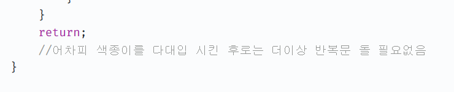
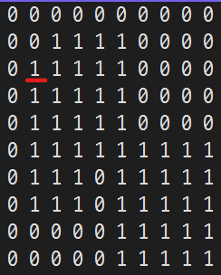
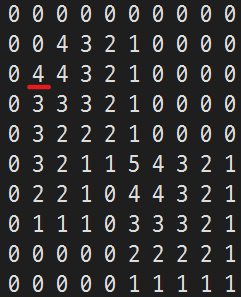

# [색종이 붙이기](https://www.acmicpc.net/problem/17136)

가지치기를 어떻게 해야하는지 고민을 해야했던 문제.

## 해결

총 다섯 종류의 색종이(크기 1부터 5까지)가 다섯개 씩, 총 25장의 색종이가 있다.  
이를 자르거나 접지 않고 적절히 배치해서 주어진 영역을 모두 채울 수 있는가를 보는 문제이다.

분명 가지치기를 하지 않으면 TLE가 날 것이 보이는데, 어디에서 가지치기를 해야 문제가 풀리는가 고민을 했다.

[](https://velog.io/@ohjinseo/%EB%B0%B1%EC%A4%80-17136%EB%B2%88-%EC%83%89%EC%A2%85%EC%9D%B4-%EB%B6%99%EC%9D%B4%EA%B8%B0-C)
> velog 참고

고민하다 영 모르겠어서 검색을 해 코드를 보니 가지치기를 이런 식으로도 고려할 수 있음을 알았다.


## 주저리
범위 검사를 굳이 하지 않아도 되도록 일전의 dp 문제에서 풀이로 활용했던 방법을 이번에 이용했다. 원래 고려했던 방법으로 한다면, 코드에 `is_fill()` 함수를 사용하지 않아도 상관 없지 않을까? 했는데 이 함수를 사용하지 않으면 18% 에서 fail이 발생한다. 고민해보니 문제 상황이 아래의 경우에 가능할 것이라는 생각이 들었다.

|   |   |
|:--------------------------------------:|:--------------------------------------:|
|              원본 데이터               |          dp 풀이를 적용한 데이터       |

이 경우에 빨간 줄 친 부분에서 검사를 하지 못하여 4장짜리가 두번 덮일 수 있다. 그래서 실제로는 답으로 7이 나와야함에도 불구하고, 6이 나와서 문제를 해결하지 못한다. 이 부분을 고려하지 않아서 fail이 나기도 했다.


`min()`함수는 initializer-list를 이용하는 방법과 두 개의 인자를 받는 방법이 있는데, 초기에 initializer-list를 이용하는 방법을 썼다가 생각보다 속도가 안 나와서 인자 두 개를 받는 방법으로 수정해본 결과 그 속도가 더 빨랐다.  
네 개의 인자를 구성했었는데, 결론으로 `min(initializer-list)`방식보다 `min(a,b)`를 세번 받는 방식이 훨씬 빠른 것을 알게 되었다.


## 코드

```cpp
#include <iostream>
#include <vector>
#include <algorithm>

#define endl "\n"

using namespace std;

template<class T>
using board_t = vector<vector<T>>;

constexpr int WIDTH = 10;
constexpr int HEIGHT = 10;

bool is_clear(const board_t<bool>& exists) {
	for (const auto& cntr : exists) {
		for (const auto& item : cntr)
			if (item == true) return false;
	}

	return true;
}
//
//bool range_validation(int x, int y, int gap) {
//	if (x < 0 || x + gap >= WIDTH) return false;
//	if (y < 0 || y + gap >= HEIGHT) return false;
//
//	return true;
//}
//
bool is_fill(const board_t<bool>& exists, const int x, const int y, const int size) {
	for (int cy = y; cy <= y + size; ++cy) {
		for (int cx = x; cx <= x + size; ++cx) {
			if (exists[cy][cx] == false) return false;
		}
	}

	return true;
}

void fill(board_t<bool>& exists, const int x, const int y, const int gap, const bool value) {
	for (int cy = y; cy <= y + gap; ++cy) {
		for (int cx = x; cx <= x + gap; ++cx) {
			exists[cy][cx] = value;
		}
	}
}

void bt(board_t<bool>& exists, const board_t<int>& d, const int _x, const int _y, vector<int>& paper, const int used_paper, int& answer) {
	if (used_paper > answer) return;

	if (is_clear(exists)) {
		answer = min(answer, used_paper);
		return;
	}

	int x = _x + 1;
	for (int y = _y; y < HEIGHT; ++y) {
		for (; x < WIDTH; ++x) {
			if (!exists[y][x]) continue;

			for (int gap = d[y][x] - 1; gap >= 0; gap--) {
				if (paper[gap] <= 0) continue;
				if (!is_fill(exists, x, y, gap)) continue;

				paper[gap]--;
				fill(exists, x, y, gap, false);
				bt(exists, d, x + gap, y, paper, used_paper + 1, answer);
				fill(exists, x, y, gap, true);
				paper[gap]++;
			}
			return;
		}
		x = 0;
	}
}

int main() {
	cin.tie(0)->sync_with_stdio(0);
	cout.tie(0);

	board_t<bool> exists(HEIGHT, vector<bool>(WIDTH));
	board_t<int> d(HEIGHT, vector<int>(WIDTH));

	for (int y = 0; y < HEIGHT; ++y) {
		for (int x = 0; x < WIDTH; ++x) {
			cin >> d[y][x];
			if (d[y][x]) exists[y][x] = true;
		}
	}

	for (int y = HEIGHT - 2; y >= 0; y--) {
		for (int x = WIDTH - 2; x >= 0; x--) {
			if (!d[y][x]) continue;

			d[y][x] = min(
				4,
				min(d[y + 1][x + 1],
					min(d[y + 1][x], d[y][x + 1])
				)
			) + 1;

			// min({ 4, d[y + 1][x + 1], d[y + 1][x], d[y][x + 1] }) + 1;

		}
	}

	int answer = 1e9;
	vector<int> paper = { 5,5,5,5,5 };
	bt(exists, d, -1, 0, paper, 0, answer);

	if (answer == 1e9) answer = -1;
	cout << answer << endl;

}
```
