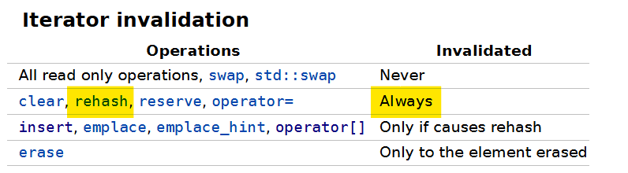

# [이진수 더하기](https://www.acmicpc.net/problem/21396)

```cpp
#include <iostream>
#include <unordered_map>

#define endl "\n"

using namespace std;

using ll = long long;

void solution() {
	ll n, x;
	cin >> n >> x;

	ll answer = 0;
	ll temp;
	unordered_map<ll, ll> data;

	for (ll i = 0; i < n; ++i) {
		cin >> temp;
		data[temp]++;
	}

	if (x)
		for (const auto& [key, value] : data) {
			if (data.find(key ^ x) != data.end())
				answer += value * data[key ^ x];
		}
	else
		for (const auto& [key, value] : data)
			answer += value * (value - 1);

	answer >>= 1;

	cout << answer << endl;

}

int main() {
	cin.tie(0)->sync_with_stdio(0);

	int T;
	cin >> T;
	while (T--)solution();

	return 0;
}
```

## 해결
문제 난이도가 어렵지 않은데 반해 C++에서는 map에 key가 있는지 없는지 판단하는 코드를 작성하는 것에 따라서 P/NP가 나뉜다.
```cpp
if(data.find(key ^ x) != data.end()){
    ....
}
```

기본적으로 unordered_map에서 존재하지 않은 key를 사용할 경우 자동으로 key를 추가하고 0과 같은 해당 데이터의 기본 값을 넣는 것으로 알고 있는데, 어째서 fail이 발생하는지 알 수가 없다.
어째서 이런 일이 벌어지는지 파악하지 못했으며, 대신 [질문글](https://www.acmicpc.net/board/view/148771)은 올려뒀다.

문제 원인으로 map에 데이터를 넣으면서 해시 충돌이 발생, 새로이 이터레이터를 생성하게 되면서 기존 range-based loop에서 사용하는 iterator가 invalidate되어 fail이 나는 것이라는 의견을 받았다. 처음부터 오류가 난다면 코드 설계의 미스이겠지만 검사 12%에서 오류가 발생하는 것을 보았을 때, 해당 시점의 테스트 케이스에서 첫 rehash가 수행되면서 fail이 발생하는 것으로 보인다.

  
[docs](https://en.cppreference.com/w/cpp/container/unordered_map)의 `Iterator invalidation` 항목을 살펴보면, rehash 함수는 언제나 기존 iterator의 validation을 깨트린다는 것을 알리고 있다.