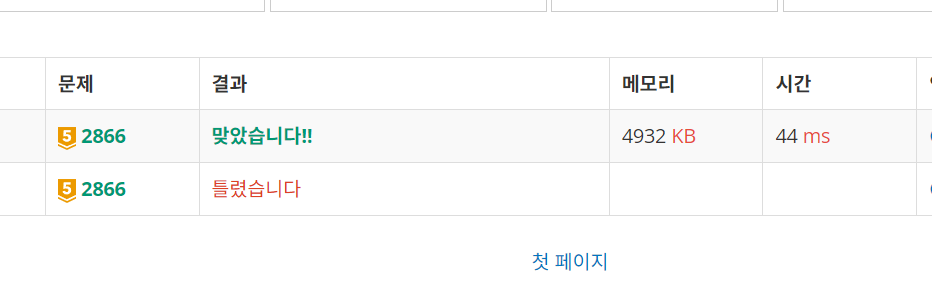

# [문자열 잘라내기](https://www.acmicpc.net/problem/2866)

```cpp
#include <iostream>
#include <vector>
#include <unordered_set>
#include <string>

using namespace std;

int main() {
	int R, C;
	cin >> R >> C;
	vector<string> arr(C);

	for (int i = 0; i < R; ++i) {
		string input;
		cin >> input;
		int k = 0;
		for (const auto& item : input) {
			arr[k] += input[k];
			k++;
		}
	}

	int s, e, mid;
	s = 0; e = R;
	while (s <= e) {
		mid = (s + e) >> 1;
		// cout << s << ", " << e << ", " << mid << ": ";
		unordered_set<string> individualGroup;

		bool isUnique = true;
		for (const auto& item : arr) {
			auto str = item.substr(mid);
			if (individualGroup.find(str) != individualGroup.end()) {
				isUnique = false;
				break;
			}
			individualGroup.insert(str);
		}

		// cout << isUnique<< endl;

		if (isUnique) {
			s = mid + 1;
		}
		else e = mid - 1;

	}
	cout << e << endl;

	return 0;
}
```

## 해결
중간점을 기준으로 중복이 발생한다면 R(e)을 줄이고, 발생하지 않는다면 L(s)을 늘리는 식으로 검색을 수행했다.

다만 처음 작성했을 때 `bool isUnique`변수의 이름을 `check` $\rightarrow$ `isDuplicated`로 변경하면서, 변수의 값이 `true일 때 중복이 없다`라는 의미를 잘못 해석하게 되면서 fail을 한번 맞았다.  
  
그래도 빠르게 인지하고 변수명 수정 및 의미에 맞게 코드를 수정하여 맞을 수 있었다.