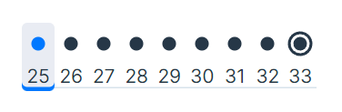

# [광고 삽입](https://school.programmers.co.kr/learn/courses/30/lessons/72414)

```cpp
#include <string>
#include <vector>
#include <tuple>
#include <algorithm>
#include <iostream>
#include <sstream>
#include <iomanip>

using namespace std;

using PlayTime = tuple<int,int>;

inline int Change(string playtime){
    auto sh = stoi(playtime.substr(0,2)) * 3600;
    auto sm = stoi(playtime.substr(3,2)) * 60;
    auto ss = stoi(playtime.substr(6,2));

    return sh + sm + ss;
}

inline PlayTime MakePlayTime(string playtime){
    return PlayTime{Change(playtime.substr(0, 8)), Change(playtime.substr(9))};
}

string solution(string play_time, string adv_time, vector<string> logs) {
    string answer = "";
    vector<PlayTime> iLog;

    for(const auto& log: logs)
        iLog.push_back(MakePlayTime(log));

    int ipt = Change(play_time);
    int iadt = Change(adv_time);

    if(ipt == iadt) return "00:00:00";

    vector<int> arr(ipt+2);

    for(const auto& log: iLog){
        int s,e;
        tie(s,e) = log;
        for(int i = s; i < e; ++i){
            arr[i]++;
        }
    }

    long long target = 0;
    long long maximum = 0; int i;
    long long slide = 0;
    for(i = 0 ;i < iadt; ++i){
        maximum += arr[i];
    }
    slide = maximum;
    for(; i < arr.size(); ++i){
        slide += arr[i] - arr[i - iadt];
        if(maximum < slide){
            maximum = slide;
            target = i - iadt + 1;
        }
    }

    auto h = target / 3600;
    target %= 3600;
    auto m = target / 60;
    target %= 60;
    auto s = target;

    stringstream ss;
    ss << setfill('0') << setw(2) << h << ":" << setw(2) << m<< ":" << setw(2) << s;

    return answer = ss.str();
}
```

## 해결
프로그래머스 스킬체크 Lv3를 통해 풀었다.  
`logs`입력이 중구난방이고, 누적 시청 시간이 가장 많은 시작 지점을 구하는 문제이다보니 처음 맞닥뜨리고 어떻게 풀어야하나 고민했던 문제였다.

다만 시간의 범위가 `00:00:00`에서 `99:59:59`까지로 최대가 `360000`이었던지라 이런 생각이 들었다.
> 이정도면 사용자 시청시간 1초마다 그에 맞는 인덱스의 값을 1씩 올려서 슬라이딩 윈도우로 풀어버릴 수 있지 않을까?

결과적으로 맞은 선택이었다.

## 기타
슬라이딩 윈도우 기법을 사용하려는 것까지는 결정하고, 구현에 들어갔는데 만일 이 방식이 TLE가 나면 어쩌나 했다. 이 방식 말고 당장에 생각나는 방식이 없었기 때문에...  
코드 작성 후 자꾸 테스트케이스 17번에서 FAIL이 나서 `왜 자꾸 FAIL이 나지` 하면서 코드를 계속 살펴봤다. 전혀 오류가 날 코드가 아니라고 생각이 드는데도 17번에서만 자꾸 오류가 났다. 또한 17번의 수행 속도가 가장 느려서 검증 데이터 양이 많음을 유추했다. 그에 따라 `설마 오버플로우 문제인가` 싶어 `target`, `maximum`, `slide` 변수를 $\text{int} \rightarrow \text{long long}$ 타입으로 변경하였다.  
결과 `오버플로우 문제임을 확인`하였고, 만점을 받을 수 있었다.

|                제출 횟수                |
| :-------------------------------------: |
|    |
| 뭐 하나 수정하고 제출하기를 반복한 결과 |
