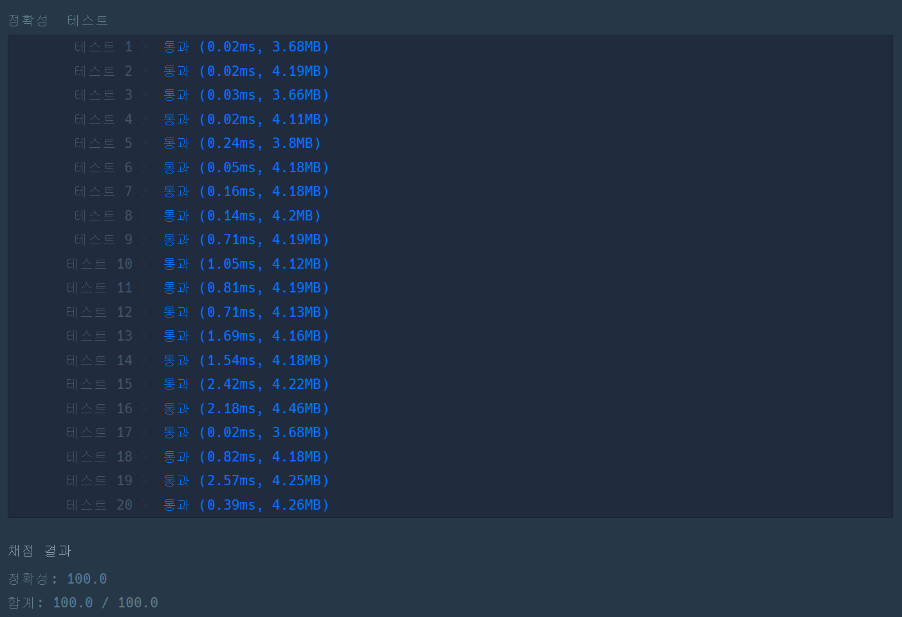

# [가장 많이 받은 선물](https://school.programmers.co.kr/learn/courses/30/lessons/258712)

```cpp
#include <string>
#include <vector>
#include <utility>
#include <tuple>
#include <map>
#include <algorithm>

using namespace std;

pair<string, string> split(string str){
    int index = str.find(' ');
    
    return {
        str.substr(0, index), str.substr(index+1)
    };
}

int solution(vector<string> friends, vector<string> gifts) {
    int answer = 0;
    
    map<string, int> idx;
    for(int i = 0 ; i< friends.size(); ++i)
        idx[friends[i]] = i + 1;
    
    vector<vector<int>> data(friends.size() + 1);
    for(auto& cont: data)
        cont.resize(friends.size() + 1);
    
    for(auto& gift: gifts){
        auto [f, t] = split(gift);
        
        int from, to;
        from = idx[f];
        to = idx[t];
        
        data[from][0]++;        // gave to other
        data[0][to]++;          // received to other
        data[from][to]++;
    }

    vector<int> giftPoint(friends.size()+1);
    for(int i = 1; i < giftPoint.size();++i)
        giftPoint[i] = data[i][0] - data[0][i];
    
    vector<int> recvGift(friends.size()+1);
    
    for(int i = 1; i < data.size(); ++i){
        for(int k = i + 1; k < data.size(); ++k){

            bool trade = data[i][k] || data[k][i];
            
            if(trade && data[i][k] != data[k][i]){
                if(data[i][k] < data[k][i]) recvGift[k]++;
                else recvGift[i]++;
                
            }else{
                if(giftPoint[i] > giftPoint[k]) recvGift[i]++;
                else if(giftPoint[i] < giftPoint[k]) recvGift[k]++;
            }
            
        }
    }
    
    answer = *max_element(recvGift.begin()+1, recvGift.end());
    
    return answer;
}
```

## 비고
순수하게 빡구현에 말장난마냥 요구사항을 길게 서술해서 귀찮았던 문제.  
map 방식은 메모리를 많이 잡아먹으면서도 느린 것으로 알고 있어서 인덱싱용 `map<name, index>` 구조의 map을 생성하고 이를 통해 인덱스를 관리하였다.  
만일 대상의 이름도 출력해야한다면 `max_element`를 사용하지 않고 반복 루프를 돌며 해당하는 인덱스를 찾고, 해당 인덱스를 map에서 찾는 방식으로 구현하지 않았을까 싶다.

## TEST CASE
전반적으로 3ms 이내에 처리되었다.  
