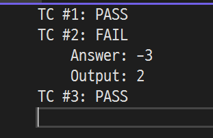

# [주사위 고르기](https://school.programmers.co.kr/learn/courses/30/lessons/258709)

```cpp
#include <string>
#include <vector>
#include <unordered_map>
#include <algorithm>

using namespace std;

using Key = vector<int>;

struct HASH {
    size_t operator()(const Key& key) const {
        size_t h = 0;
        for (const auto& item : key) {
            h *= 10;
            h += item;
        }
        return h;
    }
};

unordered_map<Key, vector<int>, HASH> sumTable;

void pre_sum(const vector<vector<int>>& dice, const vector<int>& containList, int index, int value) {
    if (index == containList.size()) {
        sumTable[containList].push_back(value);
        return;
    }
    const auto& cntr = dice[containList[index]];
    for (int i = 0; i < dice[0].size(); ++i) {
        pre_sum(dice, containList, index + 1, value + cntr[i]);
    }
}

vector<int> solution(vector<vector<int>> dice) {
    vector<int> answer;
    int maximum = 0;
    int depth = dice.size() >> 1;
    vector<int> check(dice.size());
    fill(check.begin(), check.begin() + depth, 0);
    fill(check.begin() + depth, check.end(), 1);

    do {
        vector<int> A, B;
        for (int i = 0; i < check.size(); ++i) {
            if (!check[i]) A.push_back(i);
            else B.push_back(i);
        }

        if (sumTable.find(A) == sumTable.end()) {
            pre_sum(dice, A, 0, 0);
            auto& cntr = sumTable[A];

            sort(cntr.begin(), cntr.end());

        }
        if (sumTable.find(B) == sumTable.end()) {
            pre_sum(dice, B, 0, 0);
            auto& cntr = sumTable[B];
            sort(cntr.begin(), cntr.end());
        }
        
        const auto& aPreSum = sumTable[A];
        const auto& bPreSum = sumTable[B];
        int count = 0;
        for(const auto& item: bPreSum){
            auto iter = upper_bound(aPreSum.begin(), aPreSum.end(), item);
            if(iter == aPreSum.end()) continue;
            count += aPreSum.end() - iter;
        }

        if(maximum < count){
            maximum = count;
            answer = A;
        }
        
    } while (next_permutation(check.begin(), check.end()));

    for (auto& item : answer)
        item++;

    return answer;
}
```

## 해결
코드는 다음으로 진행된다.
- A,B가 고를 주사위에 대한 순열을 생성한다
- 각 순열에 대해 만들어질 수 있는 전체 주사위 합을 구해 별도로 저장한다
- B의 주사위로 만들어진 값 $\beta$ 를 기준으로 A 주사위 값에 대해 upper_bound로 $\beta$ 보다 큰 $\alpha$ 의 첫 인덱스를 구한다.
- 인덱스 연산으로 이기는 경우의 수를 구하고, 이를 통해 최종 답을 도출한다.

생각보다 오래 걸렸던 문제. 설계에 대한 아이디어는 오래 걸리지 않고 떠올렸다. 그런데 vector를 map의 키값으로 사용하게 되면서 해시 함수 설계가 미숙해서 발생한 문제라고 생각한다.  
단순히 생각하면 이 문제에 대한 collision만 제어하면 될 것을 vector 요소 값에 xor했다가 이거 붙였다 저거 붙였다 shift 썼다가 하면서 시간을 허비했던게 컸다. 제한사항을 잘 살펴보고 그 조건에 충돌이 일어나지 않게만 설계하도록 하자.

<details>
<summary>테스트 코드</summary>
아래는 해시 함수 설계가 영 아니어서 VS에서 테스트하려고 만든 것. 테스트해보려면 위 코드에 이어서 아래 코드를 넣으면 된다.

```cpp
#include <iostream>
#include <tuple>

using Dice = vector<vector<int>>;
using Answer = vector<int>;

int main() {

	vector<tuple<Dice, Answer>> test = {
		make_tuple(
			Dice{{1, 2, 3, 4, 5, 6},{3, 3, 3, 3, 4, 4},{1, 3, 3, 4, 4, 4},{1, 1, 4, 4, 5, 5}},
			Answer{1,4}
		),
		make_tuple(
			Dice{{1, 2, 3, 4, 5, 6},{2, 2, 4, 4, 6, 6}},
			Answer{2}
		),
		make_tuple(
			Dice{{40, 41, 42, 43, 44, 45},{43, 43, 42, 42, 41, 41},{1, 1, 80, 80, 80, 80},{70, 70, 1, 1, 70, 70}},
			Answer{1,3}
		)
	};

	int TC = 1;
	for (const auto& [input, output] : test) {
		sumTable.clear();

		auto res = solution(input);
		bool check = output == res;
		cout << "TC #" << TC << ": " << (check ? "PASS" : "FAIL") << "\n";
		TC++;
		if (check == false) {
			cout << "\tAnswer: ";
			for (const auto& item : output)
				cout << item << " ";
			cout << endl;
			cout << "\tOutput: ";
			for (const auto& item : res)
				cout << item << " ";
			cout << endl;
		}
	}

}
```

출력시 아래와같이 나온다. 이미지상 TC2의 경우 Fail을 보여주기 위해 임의로 Answer 값을 바꾼것으로 2가 맞다.  

