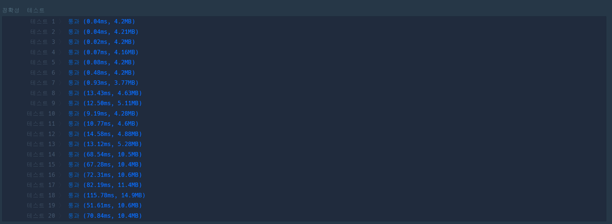

# [\[PCCP 기출문제\] 3번 / 충돌위험 찾기](https://school.programmers.co.kr/learn/courses/30/lessons/340211)

시뮬레이션 형태의 문제로 생각된다.

풀이과정을 설명하는 대략 다음과 같다.
- 기체별 시간에 따른 좌표를 모두 구해 큐에 넣는다
- 각 큐별로 하나씩 뽑아 기체가 둘 이상으로 카운트 되는 위치의 수를 계산한다.


```cpp
#include <string>
#include <vector>
#include <utility>
#include <cmath>
#include <queue>
#include <unordered_map>

using namespace std;

#define R first
#define C second

using Point2D = pair<int,int>;

struct cHASH{
    size_t operator()(const Point2D& pos) const{
        return pos.R * 101 + pos.C;
    }
};

queue<Point2D> findRoute(const vector<vector<int>>& points, const vector<int>& route){
    queue<Point2D> ans;

    const auto& s = points[route[0]-1];
    Point2D pos = {s[0], s[1]};
    ans.push(pos);
    
    for(auto i = 1ull; i < route.size(); ++i){
        const auto& e = points[route[i]-1];
        Point2D goal = {e[0], e[1]};
        
        while(pos != goal){
            if(pos.R != goal.R){
                pos.R += (goal.R - pos.R) / abs(pos.R - goal.R);
            }
            else{
                pos.C += (goal.C - pos.C) / abs(pos.C - goal.C);
            }
            
            ans.push(pos);
        }
    }
    
    return ans;
}


int solution(vector<vector<int>> points, vector<vector<int>> routes) {
    int answer = 0;
    
    vector<queue<Point2D>> routeLog;
    for(const auto& route: routes){
        routeLog.push_back(findRoute(points, route));
    }
    
    while(routeLog.size()){
        unordered_map<Point2D, int, cHASH> check;
        for(auto i = 0ull; i < routeLog.size(); ++i){
            if(routeLog[i].empty()) {
                routeLog.erase(routeLog.begin()+i);
                --i;
                
                if(routeLog.size() == 0) break;
                
                continue;
            }
            auto& q = routeLog[i];
            check[q.front()]++;
            q.pop();
        }

        for(const auto& [key, val]: check){
            if(val != 1) answer++;
        }
    }
    
    return answer;
}
```
