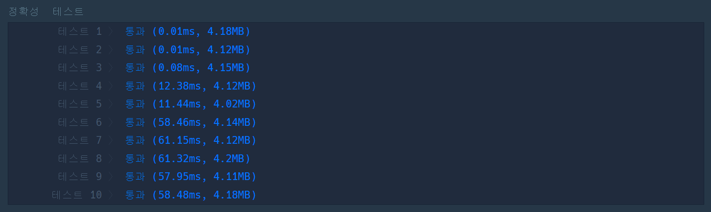

# [고고학 최고의 발견](https://school.programmers.co.kr/learn/courses/30/lessons/131702)

중복 순열에 그리디 알고리즘을 적용한 방식으로 풀면 풀이가 풀린다.

중복 순열을 구현하기 힘들다면 [백준 P.15651 - N과 M (3)](https://www.acmicpc.net/problem/15651) 문제를 풀어보면 도움이 된다.  
만일 그리디를 구현하기 힘들면 [백준 P.30023 - 전구 상태 바꾸기](https://www.acmicpc.net/problem/30023) 문제를 풀면 도움이 된다.

이 문제는 위 언급한 두 문제의 코드를 적절히 활용하여 시간 복잡도를 줄여 시간 내 최소 회전수를 구하는 문제로 볼 수 있다.

## 해결
어떻게 최적화 할것인가가 관건인 문제라 볼 수 있겠다. 칸에 들어갈 수 있는 값은 $[1, 2, 3, 4]$ 총 네 개, 최대 64칸을 입력으로 받을 수 있으므로 단순히 브루트포스로 수행할 경우 $4^{64}$의 경우의 수가 발생할 수 있다.

N개의 줄에서 1개의 줄은 다른 줄에 의해 연산이 수행된다. 결과가 보증된다고 하였기 때문에 아래와 같은 경우는 나오지 않는다.
$$
\begin{matrix}
0 & 0 & 0\\
0 & 1 & 0\\
0&0&0\\
\end{matrix}
$$

기준점을 중심점 $A_{x,\,y}$로 정하지 말고, 한칸 위인 $A^\prime_{x,\,y+1}$로 설정하면 해당 줄의 연산이 끝나면 해당 줄은 더이상 추가 연산을 수행할 필요가 없으므로 연산은 아래 방향으로만 설정하면 된다. 0으로 되어있지만 회전을 4번 해서 0이 된 위치가 있을 수 있기 때문에 만일 이런 곳이 별도의 연산이 들어가면 오답 처리가 된다.
$$
\begin{matrix}
{\color{cyan}3}&{\color{yellow}0}&{\color{hotpink}1}\\
3&0&1\\
0&0&0
\end{matrix}
\rightarrow
\begin{matrix}
1&1&2\\
3&3&1\\
1&1&0
\end{matrix}
\\
{\color{cyan}\text{3번 회전한 곳과 }} {\color{hotpink}\text{1번 회전한 곳}\text{의 결과로}}\,{\color{yellow}{\text{0이 되어버린 곳}}}\\
\rightarrow \text{그리디하게 풀어버린 결과}
$$

따라서 임의 한 라인을 순열 만들듯이 사전 연산을 수행한 뒤, 이를 그리디하게 풀어내는 것이 이번 문제의 요점이다.

아래 코드는  
한 라인을 순열로 처리하는 `setFirstLine`  
그렇게 만들어진 매트릭스를 그리디하게 풀어내는 `change`  
마지막으로 문제가 풀렸는지 확인하는 `isAligned`  
총 세 부분으로 나누어 처리하였다.


```cpp
#include <string>
#include <vector>
#include <numeric>
#include <tuple>

using namespace std;

using Point2D = tuple<int,int>;

static vector<Point2D> offsets={
    {0,0},
    {0,1},
    {1,0},
    {0,-1},
    {-1,0}
};

bool isAligned(const vector<vector<int>>& clockHands){
    int value = 0;
    for(int y = 0 ;y < clockHands.size(); ++y)
        value += accumulate(clockHands[y].begin(), clockHands[y].end(), 0);
    
    return value == 0;
}

int change(vector<vector<int>> clockHands, int& res){
    res = 0;
    for(int y = 0; y < clockHands.size() - 1; ++y){
        for(int x = 0 ; x < clockHands[0].size(); ++x){
            if(clockHands[y][x] == 0) continue;
            
            auto updateValue = 4 - clockHands[y][x];
            
            for(auto [cx,cy]: offsets){
                cx += x; cy += y+1;
                if(cx < 0 || cx >= clockHands[0].size()) continue;
                if(cy < 0 || cy >= clockHands.size()) continue;
                
                auto& item = clockHands[cy][cx];
                
                item = (item + updateValue) % 4;
            }
            
            res += updateValue;
        }
    }

    return isAligned(clockHands);
}

int setFirstLine(vector<vector<int>>& clockHands, int index, int depth){
    int ans = 1e9;
    if(index == clockHands[0].size()){
        int res;
        if(change(clockHands, res)){
            return depth + res;
        }
        return (int)1e9;
    }
    
    for(int i = 0; i< 4; ++i){
        ans = min(ans, setFirstLine(clockHands, index+1, depth+i));
        
        for(auto [cx,cy]: offsets){
            cx += index;
            if(cx < 0 || cx >= clockHands[0].size()) continue;
            if(cy < 0 || cy >= clockHands.size()) continue;
            auto& item = clockHands[cy][cx];
            item = (item+1) % 4;
        }
    }
    
    return ans;
}


int solution(vector<vector<int>> clockHands) {
    int answer = 0;
    
    answer = setFirstLine(clockHands, 0, 0);
    
    return answer;
}
```
