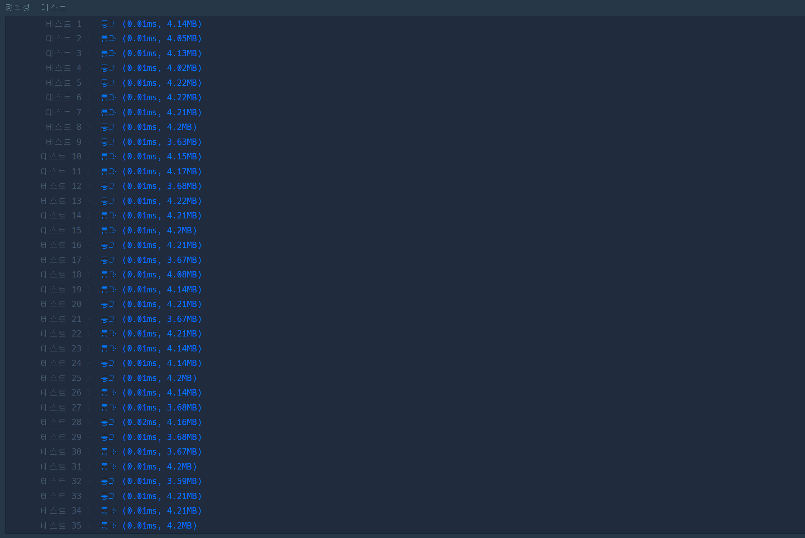

# [광물 캐기](https://school.programmers.co.kr/learn/courses/30/lessons/172927#)

```cpp
#include <string>
#include <vector>
#include <algorithm>
#include <numeric>

using namespace std;

int toFatiga(string str, int pickax){
    static int fatiga[][3] = {
        {1,1,1},
        {5,1,1},
        {25,5,1}
    };
    
    switch(str[0]){
        case 'd': return fatiga[pickax][0];
        case 'i': return fatiga[pickax][1];
        case 's': return fatiga[pickax][2];
    }
}

int solution(vector<int> picks, vector<string> minerals) {
    int answer = 0;

    int nPickax = picks[0] + picks[1] + picks[2];
    vector<vector<int>> container;
    for(int i = 0 ; i< minerals.size(); ++i){
        if(i / 5 == container.size()) container.emplace_back(vector<int>(4));
        if(i / 5 == nPickax) break;
        
        
        auto& v = container[i / 5];
        
        v[0]++;
        v[1] += toFatiga(minerals[i],0);
        v[2] += toFatiga(minerals[i],1);
        v[3] += toFatiga(minerals[i],2);
    }

    sort(container.begin(), container.end(), [](vector<int>& a, vector<int>& b){
        if(a[3] > b[3]) return true;
        if(a[3] == b[3] && a[0] < b[0]) return true;
        
        return false;
    });
    
    int index = 0;
    while(!picks[index])index++;
    
    for(int i = 0; i < container.size(); ++i){
        while(!picks[index]) index++;
        picks[index]--;
        answer += container[i][index+1];
    }
    
    return answer;
}
```

## 해결

그리디 기반으로 해결했다. 공개된 테스트케이스에선 정상인데, 계속 테스트케이스 11부터 6-7 곳에서 통과하지 못해 무슨 문제인가 싶었는데, 마지막 `answer` 구하는 곳에서 while-loop으로 곡괭이가 존재하는지 여부를 판단해야할 것을 `if-else`로 처리하여 fail처리가 났던 것으로 생각된다.  
해당 문제를 인지, 수정한 결과 통과하였다.

## Q. sort에서 a[0]과 b[0]은 왜 비교하는가?

다음과 같은 입력이 주어진다고 하자. 입력의 광석 데이터는 각 광석의 첫글자에 해당한다.
| 곡괭이  | 광석             |
| :------ | :--------------- |
| 1, 1, 0 | i, i, i, i, i, d |

이 경우라면, 다이아 곡괭이로 iron 5개를 캐는 것과 철 곡괭이로 dia 하나를 캐는 것은 동일한 피로도를 소진한다. 그러나 철 곡괭이로 철 5개, 다이아 곡괭이로 다이아 5개를 캐면 5+1로 6의 최선값이 출현한다. 즉, 광석 집합 A와 B 중  피로도는 같은데 B 집합의 광석 수가 적다면 B를 더 좋은 곡괭이로 캐야한다. 따라서 sort 과정에서 앞으로 보내기 위해 값을 이와 같이 처리하였다.

## Testcase

| 곡괭이 | 광석                                                                        | 결과 | 비고                         |
| :----- | :-------------------------------------------------------------------------- | :--- | :--------------------------- |
| 2,1,0  | ["d", "d", "d", "d", "d", "i", "i", "i", "i", "i", "d", "d", "d", "d", "d"] | 15   |                              |
| 1,1,0  | ["d", "d", "d", "d", "d", "d"]                                              | 10   |                              |
| 1,1,0  | ["i", "i", "i", "i", "i", "d"]                                              | 6    | sort시 반전 필요             |
| 1,0,1  | ["i", "i", "i", "i", "d", "d", "d"]                                         | 47   | answer구할 때 while-loop판별 |



## 기타

그리디 알고리즘 외에 dfs로도 해결이 가능하다고 한다. bt는 당연히 될 듯.
