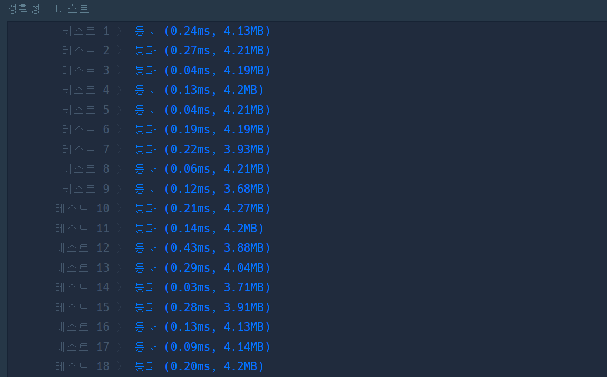
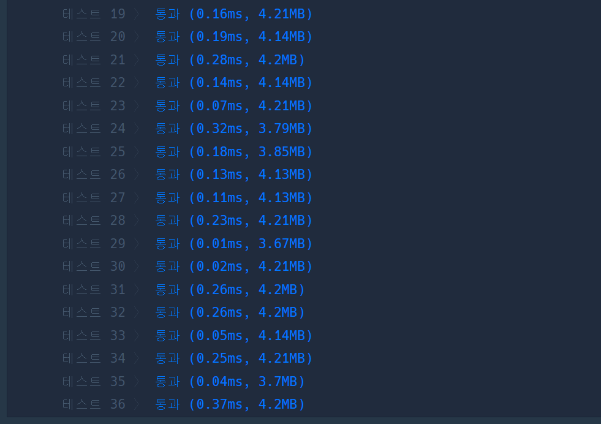

# [당구 연습](https://school.programmers.co.kr/learn/courses/30/lessons/169198)

```cpp
#include <string>
#include <vector>
#include <tuple>
#include <limits>

using namespace std;

vector<int> solution(int m, int n, int startX, int startY, vector<vector<int>> balls) {
    vector<int> answer;
    
    for(auto& ball: balls){
        int rx,ry;
        rx = startX + ((m - startX) << 1);
        ry = startY + ((n - startY) << 1);
        
        
        vector<tuple<int,int, bool>> lens ={ // left top right bottom
            make_tuple(-startX - ball[0], startY - ball[1], startY != ball[1] || startX < ball[0]),
            make_tuple(startX - ball[0], ry - ball[1], startX != ball[0] || startY > ball[1]),
            make_tuple(rx - ball[0], startY - ball[1], startY != ball[1] || startX > ball[0]),
            make_tuple(startX - ball[0], -startY - ball[1], startX != ball[0] || startY < ball[1])
        };
        
        int minimum = numeric_limits<int>::max();
        for(auto [x,y, possable]: lens){
            if(!possable) continue;
            int temp = x*x + y*y;
            if(minimum > temp) minimum = temp;
        }
        
        answer.emplace_back(minimum);
        
    }
    
    return answer;
}
```

## 문제 해결

본 문제는 시작점이나 끝점을 대칭이동시켜 이동하는 경로가 직선이 되도록 만드는 것을 고려할 수 있는가 없는가를 판별하는 문제라 생각한다.  

또한, 이동하는 방향으로 `target ball`이 존재하면 문제의 규칙으로 나온 원쿠션을 성립할 수 없기에, 이에 대한 예외 처리를 어떻게 처리할 것인지 볼 수 있는 문제라 할 수 있다.  
> 1. 대칭이동 기준선과 평행한 좌표가 (left-right축 이동의 대칭이동이라면 Y축) 서로 달라야 하며,
> 2. 같다면 대칭 이동한 좌표와 원 좌표 사이에 target ball이 존재하지 않아야 한다.  

나의 경우에는 tuple의 index 2에 해당 조건을 충족하는지를 판별한 T/F값을 추가해 이를 해결했다.


|  |  |
| :-----------------------------------: | :-----------------------------------: |

