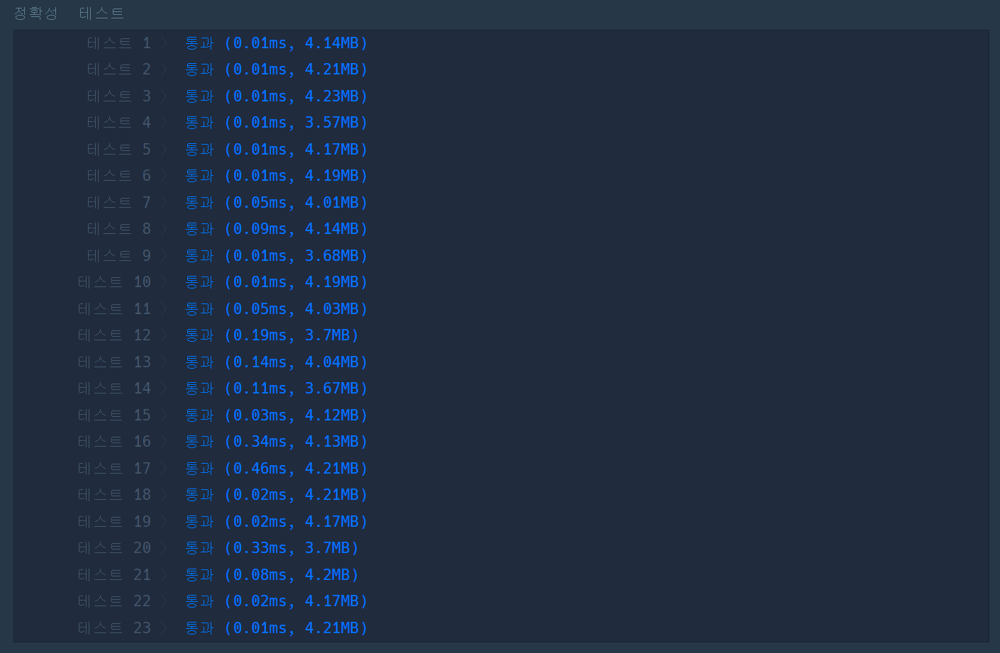

# [미로 탈출](https://school.programmers.co.kr/learn/courses/30/lessons/159993?language=cpp)

```cpp
#include <string>
#include <vector>
#include <queue>
#include <tuple>
#include <cmath>

using namespace std;

tuple<int,int,int> findRoute(vector<string>& maps, tuple<int,int> start, const char target){
    queue<tuple<int,int,int>> q;
    int x,y,value;
    tie(y, x) = start;
    q.emplace(x, y, 0);
    vector<string> visited(maps);
    
    while(!q.empty()){
        tie(x,y,value) = q.front(); q.pop();
        
        if(visited[y][x] == 'X') continue;

        if(target == visited[y][x]) return {x,y,value};
        
        value++;
        q.emplace(max(0, x-1),y,value);
        q.emplace(min((int)maps[0].length()-1, x+1),y,value);

        q.emplace(x,max(0, y-1),value);
        q.emplace(x,min((int)maps.size()-1, y+1),value);
        
        visited[y][x] = 'X';
    }
    
    return {-1,-1,-1};
}

inline bool isPossable(tuple<int,int,int> data){
    return std::get<0>(data) != -1;
}

int solution(vector<string> maps) {
    int answer = 0;
    
    tuple<int,int,int> findL;
    for(int line = 0; line < maps.size(); ++line){
        int index = maps[line].find('S');
        
        if(index != -1){
            findL = findRoute(maps, {line, index}, 'L');
            break;
        }
    }
    
    if(isPossable(findL) == false) return -1;
    
    auto findE = findRoute(maps, {std::get<1>(findL), std::get<0>(findL)}, 'E');
    
    if(isPossable(findE) == false) return -1;
    
    return std::get<2>(findL) + std::get<2>(findE);
}
```

## 해결

탐색을 어떻게 할 것인가가 중요한 간단한 BFS 기반의 문제.  
일단 시작점 $S$를 찾고, 찾은 위치에서 레버 $L$을 찾는다. 여기에서 핵심은 이때 $E$는 무시하고 지나갈 수 있다는 점.  
a. `L을 찾았다면, L까지의 거리를 보관`한다. 그리고 $L$의 위치에서 $E$의 위치를 탐색, 그 거리 b.를 직전에 찾은  $S\rightarrow L$까지의 거리를 $L\rightarrow E$까지의 거리와 더해 반환한다.  
단 문제에서 레버를 꼭 거쳐야 한다고 하였으므로, $S\rightarrow L$, $L\rightarrow E$간에 이동이 가능한지를 판단해야 한다.

## 기타

문제 자체는 bfs를 공부한 학생이라면 쉽게 풀이가 가능한 수준이다. 나의 경우에도 입력 `maps`를 복제해 이를 visited로 사용하였다.  
또한, 두 구간에 거쳐 탐색을 진행하므로, 코드 재사용성을 위해 시작 위치와 찾을 대상을 따로 입력받도록 하였다.  
다만 한가지 조심해야할 부분은 다음이다.
> findRoute의 시작점에 대한 x y좌표에 대해 순서를 헷갈리지 말 것.

풀이 과정상에 `solution` 함수에서 `findRoute`를 호출할 때는 y, x 순으로 해놓고선,
```cpp
findL = findRoute(maps, {line, index}, 'L');
```
정작 사용할 때는 x,y 순으로 queue에 집어넣어 문제 해결상 혼동이 왔다. `주의할 것`

